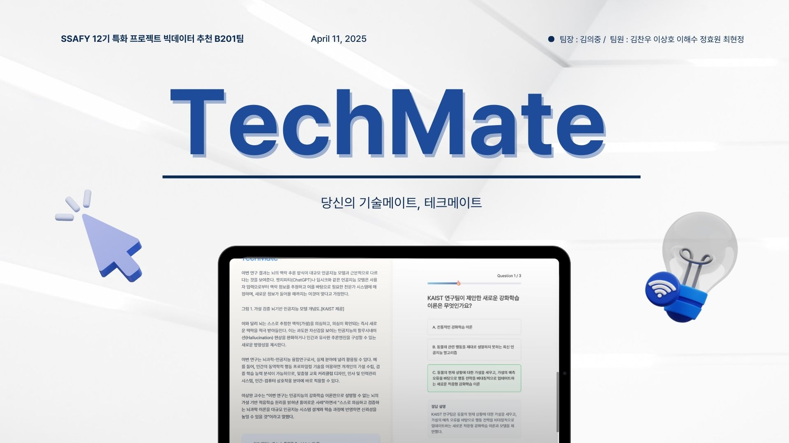
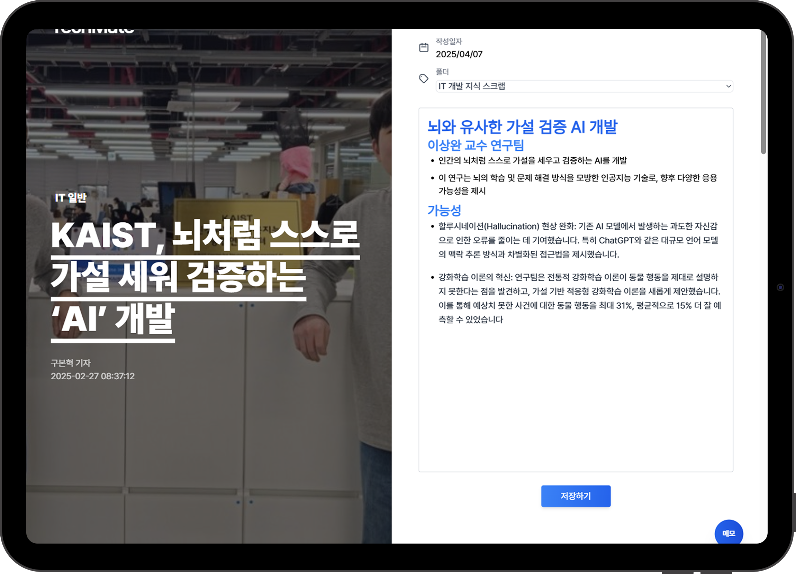
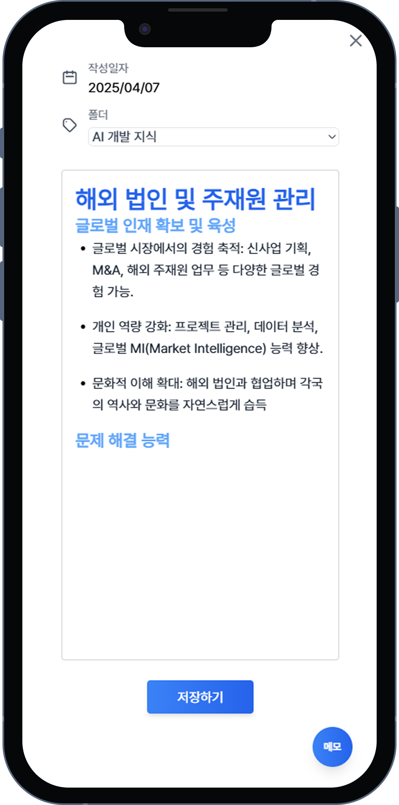
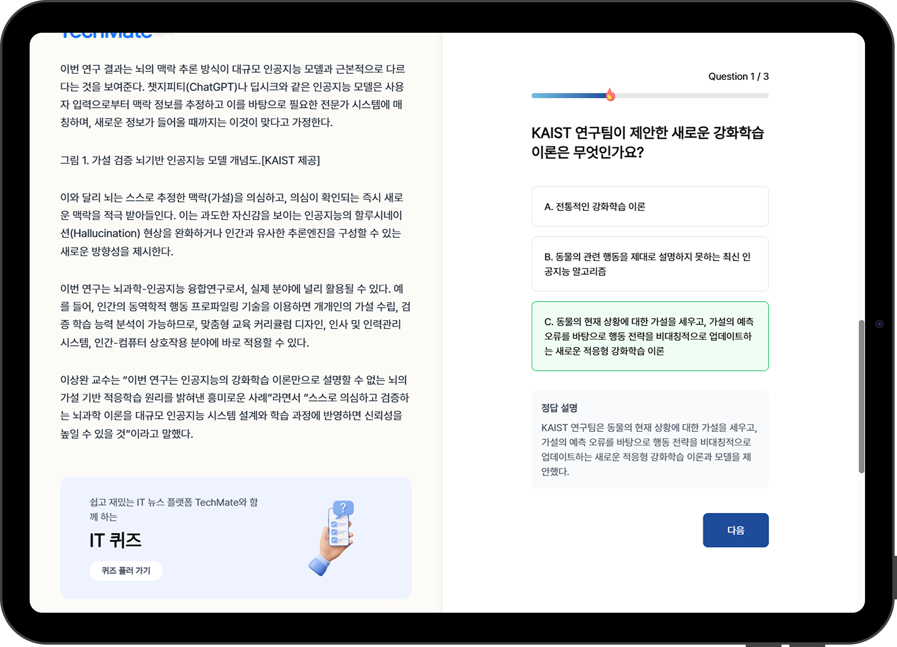
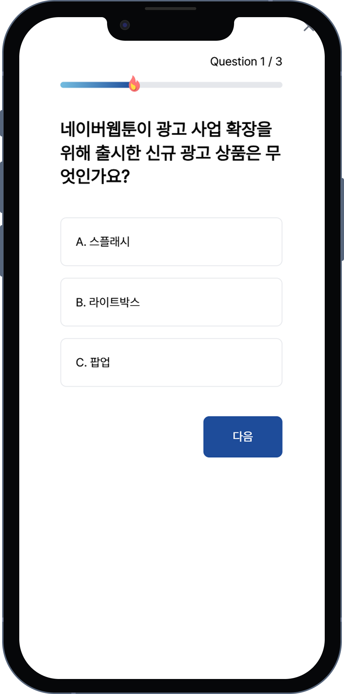
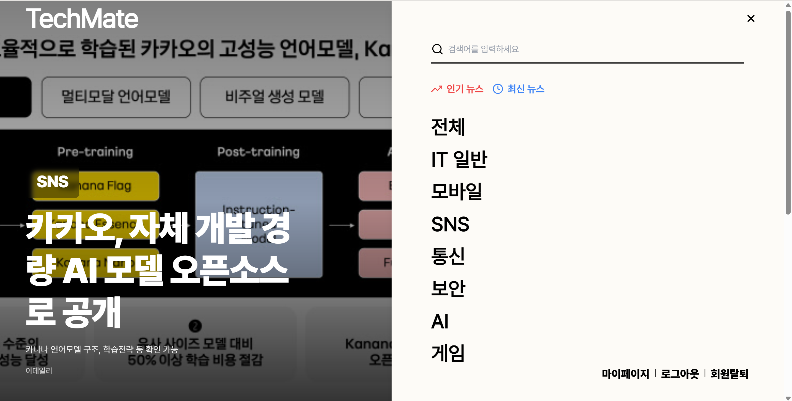
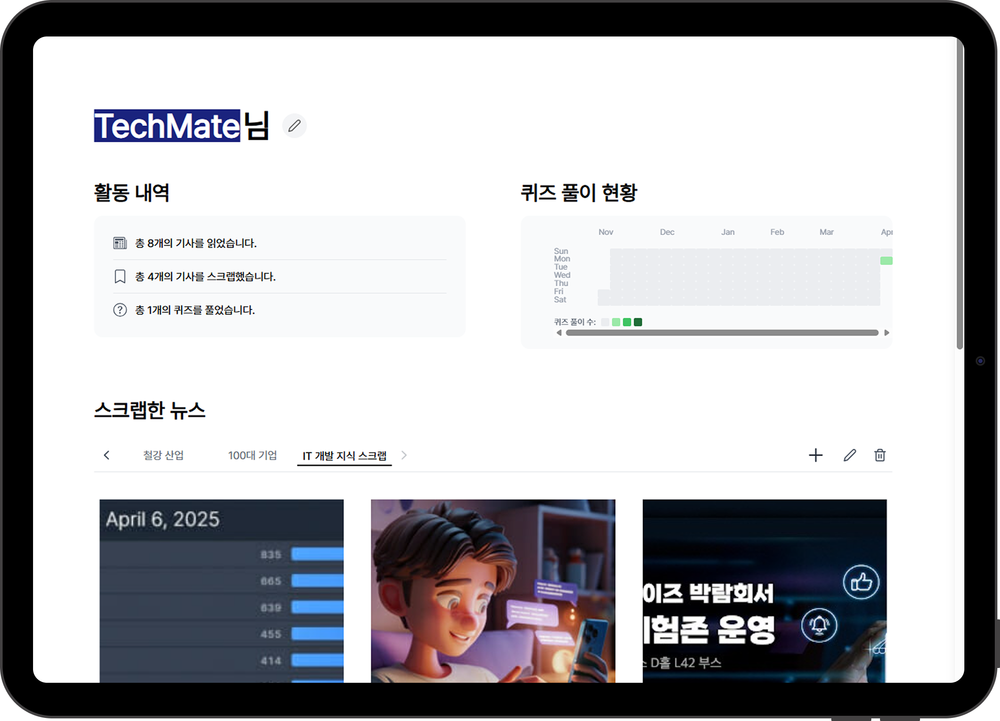
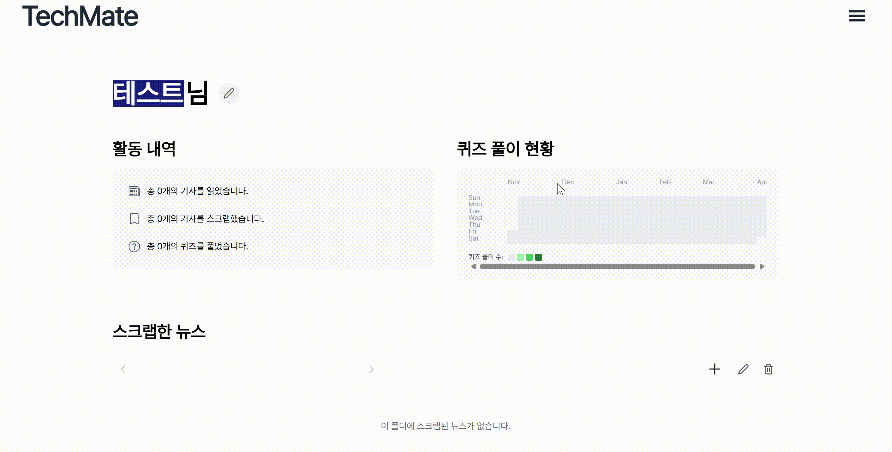

# TechMate

 

## 프로젝트 개요👟
- **프로젝트 이름**: TechMate(테크메이트)
- **진행 기간**: 2025.02.24 ~ 2025.04.11
- **서비스 한줄 소개**: IT 취준생을 위한 개인 맞춤형 IT 기사 플랫폼 (웹 및 모바일 지원)

 

## 프로젝트 배경🧭
IT 취업 준비생의 증가로 취업 시장에 대한 정보의 중요성이 대두되고 있습니다. 예를 들어, 반도체 산업군의 축소와 방산업계의 호황으로 인해 방산 직군의 수요가 증가하는 등 변화하는 시장 트렌드를 파악하는 것이 필수적입니다.

기존 서비스는 IT 카테고리만 제공하며, 개인 맞춤형 기사 추천이나 저장 기능이 부족합니다. 복잡한 광고 화면과 연관성 없는 기사 추천, 스크랩 및 메모 기능 부재로 사용자 경험이 제한적입니다. 이러한 문제를 해결하기 위해 **TechMate**를 개발하였습니다.

### 프로젝트 목표
- **개인 맞춤형 기사 추천**: 사용자 기반 협업 필터링을 활용하여 정교한 추천 제공
- **직관적 UI/UX**: 사용자 경험을 극대화하는 간결하고 효율적인 디자인
- **다양한 부가 기능**: 스크랩, 메모, 퀴즈 생성 등으로 단순 기사 읽기를 넘어선 경험 제공

---
 

## 주요 기능 및 서비스 화면

### 0. 인트로 페이지
- 사이트 소개 및 구글/카카오 소셜 로그인 지원

 

### 1. 사용자 정보 등록 페이지
- 닉네임 및 관심 기사 3가지 입력
- 초기 콘텐츠 기반 필터링 → 사용자 로그 기반 협업 필터링으로 콜드 스타트 문제 해결

 

### 2. 메인 페이지
- **맞춤형 기사 추천**: 비대칭 스크롤 구조와 무한 스크롤 구현으로 집중력 향상

 

### 3. 기사 상세 페이지
- 기사 내용, 좋아요, 스크랩, 퀴즈 생성 버튼 제공
- 추천 기사 4가지 표시

#### 3-1. 메모 페이지
- 스크랩 시 폴더 선택 및 생성 가능
- 마크다운 지원 메모장 제공 → 직관적 기록 가능
- 메모 완료 시 초록색 버튼 표시로 접근성 강화

#### 3-2. 퀴즈 페이지
- AI 기반 기사 분석 후 관련 문제 생성 (3문제)
- 퀴즈 결과와 해설 제공 → 기사 내용을 보다 효과적으로 기억 가능

 

### 4. 네비게이션(Nav)
- 카테고리 이동, 키워드 검색, 마이페이지 이동, 로그아웃 및 회원 탈퇴 기능 포함

 

### 5. 마이페이지
- 사용자 현황 및 퀴즈 풀이 기록 확인 가능
- 닉네임 수정, 스크랩한 기사 관리 (폴더 추가/수정/삭제)

---

 

## 프로젝트 구조 및 설계 산출물

### 설계 자료
1. **시퀀스 다이어그램**: [Notion 링크](https://www.notion.so/1b260a1ef67280e5a45cde45443a8918)
2. **화면 설계 (Wireframe)**: [Figma 링크](https://www.figma.com/design/kp01dAosVVnBr3xcTK9EWt/B201?node-id=61-5278&t=BQwcxWqOpQDLf0Ry-1)
3. **시스템 아키텍처** [Notion 링크](https://www.notion.so/1c060a1ef67280c59561ea22bbc468bf)
4. **ERD**: [Notion 링크](https://www.notion.so/ERD-1b460a1ef67280cb8f94d3822c8a5e6f)
5. **요구사항 명세서**: [Notion 링크](https://www.notion.so/1a660a1ef672805b81a4dca930b5fb3a)
6. **기능 명세서**: [Notion 링크](https://www.notion.so/1ad60a1ef67280b59d1aeefa2bd20d5e)
7. **API 명세서**: [Notion 링크](https://www.notion.so/API-1ae60a1ef672800ba1dfd6a341d0e86c)

---

 

## 기술 스택

| **분류**         | **기술 및 도구**                                                                 |
|-------------------|----------------------------------------------------------------------------------|
| **운영체제**      | Ubuntu 20.04 LTS, macOS 12 이상, Windows (WSL2 권장)                            |
| **개발 도구**     | IDE: Visual Studio Code (프론트엔드), IntelliJ IDEA, Visual Studio Code (백엔드) |
|                   | 버전 관리: Git                                                                  |
|                   | 컨테이너화 도구: Docker, Docker Compose                                         |
| **언어 및 프레임워크** | JavaScript: Node.js (v22.12.0 LTS), React (v19.0.0)                             |
|                   | Java: OpenJDK 17, Spring Boot (v3.4.3), Spring Data JPA, Spring Security        |
|                   | Python: Python 3.9 이상, FastAPI                                                |
| **데이터베이스**  | MySQL (v8.0 이상), MongoDB (v5.0 이상), Redis (v7.0 이상)                       |
| **인프라 도구**   | Jenkins, Nginx (v1.27.6)                                                        |
| **패키지 관리자** | npm, Gradle, pip                                                                |

---

 

## 팀원 소개

| 이름       | 역할                      |
|------------|---------------------------|
| 김의중     | 인프라/백엔드 (팀장)      |
| 김찬우     | 백엔드                   |
| 이해수     | 데이터       |
| 이상호     | 프론트엔드               |
| 최현정     | 프론트엔드               |
| 정효원     | 프론트엔드               |
